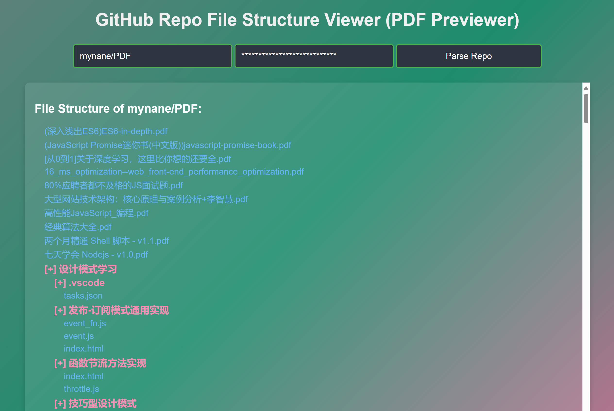
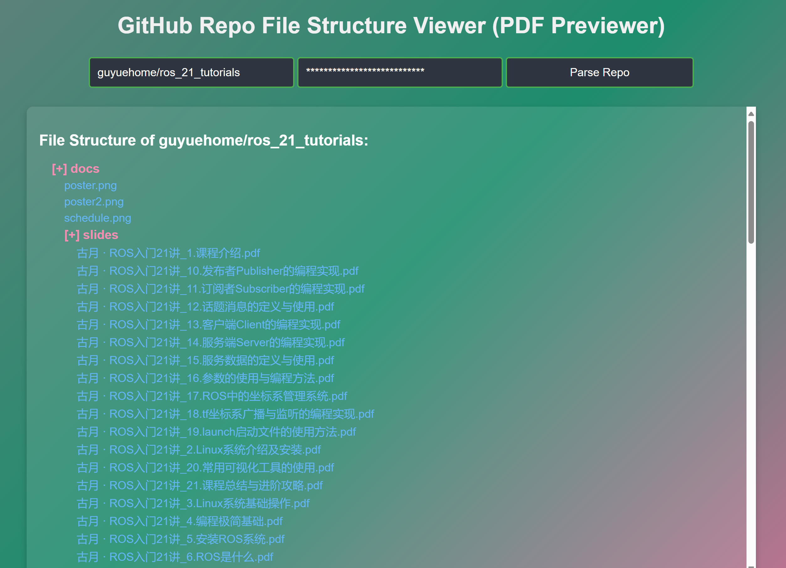

# GitHub Repo File Structure Viewer (PDF Previewer)

## Motivation
Viewing and previewing PDF files on GitHub is inconvenient. GitHub doesn't natively support inline PDF viewing, requiring additional steps for developers and users to access documentation. To streamline this process, we’ve created the GitHub Repo File Structure Viewer (PDF Previewer) to provide a clear visualization of a GitHub repository's file structure while enabling the direct preview of PDF files.

## Features
- Displays the full file structure of a GitHub repository.
- Provides direct links to PDF files via jsDelivr CDN for quick online previewing.
- Non-PDF files link to the raw GitHub file page.
- Supports GitHub Token for higher access permissions (optional).

## Example Demonstration
### 1. Input Repository: `mynane/PDF` 
### 2. Input Repository: `guyuehome/ros_21_tutorials` 